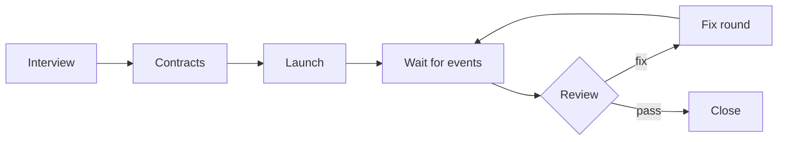

<h1 align="center">herdsman</h1>

<p align="center">
  <strong>Run a whole team of coding agents from one conversation.</strong>
</p>

<p align="center">
  <a href="https://github.com/arafathusayn/herdsman/actions/workflows/tests.yml"></a>
  <a href="LICENSE"></a>
</p>

herdsman is a skill for coding agents. You talk to one agent, the orchestrator, and it runs the rest of the team inside [herdr](https://github.com/herdrdev/herdr): implementers write the code, reviewers check it, and an integrator combines the work when it ships as one branch. Fixes and reviews go round until each task passes.

```
/herdsman run "tasks: issues 12 and 14; implementers: <harness> <model>; reviewer: <harness> <model>"
```

---

## Contents

- [The team](#the-team)
- [How a route runs](#how-a-route-runs)
- [Features](#features)
- [Install](#install)
- [Usage](#usage)
- [Requirements](#requirements)
- [Develop](#develop)
- [Design notes](#design-notes)
- [License](#license)

---

## The team

Every agent runs in its own herdr pane. Each one can use a different harness and a different model: any coding agent that herdr can start and recognize in a pane can take any role.

| Role | What it does |
| --- | --- |
| **Orchestrator** | The session you talk to. It runs the interview, writes the contracts, launches and watches the other agents, forwards review findings and records the results. It never writes application code and never pushes. |
| **Implementer** | One per task. It writes the code and the tests for its task on its own branch. |
| **Integrator** | Used when several tasks ship as one branch or one pull request. It combines the accepted task branches, fixes what breaks between them, and is the only agent that pushes and answers review threads. |
| **Reviewer** | Reviews each task branch and, before a push, the combined result. It reports only P0 and P1 findings and changes nothing. |

## How a route runs



1. **Interview.** The orchestrator asks once for the tasks, branches, harnesses, models, integration style, merge policy and test setup. It then shows a dispatch plan and waits for your go.
2. **Contracts.** It writes a route folder: shared rules, one contract per task, a reviewer contract, and an integrator contract when tasks are combined.
3. **Launch.** It opens the herdr tabs and panes, starts the agents, and sends each implementer a full brief: the goal, numbered steps with a check for each, a leave-alone list, time limits and the report format.
4. **Wait.** A background waiter exits on the first event. The orchestrator handles it, runs a health check, and starts the waiter again.
5. **Review.** Each finished task goes to a reviewer. A `fix` verdict sends it back to the implementer; a `pass` verdict closes it. When tasks are combined, the integrator merges the accepted branches in phases, and only a passing final review of the combined head lets it push.
6. **Close.** The orchestrator records the results and saves the lessons to memory. General lessons become rules in the skill's [reference files](skills/herdsman/references) or its tool notes.

## Features

**Work in parallel**

- **Parallel implementers.** One agent per task, each in its own pane, optionally in its own git worktree and branch.
- **One pull request or many.** Each implementer opens its own pull request, or an integrator combines the tasks into one branch.
- **No-commit routes.** When commits are not allowed, reviews use tree snapshots taken from a temporary git index.

**Keep quality high**

- **Strict review.** Reviewers, usually on a stronger model than the implementers, report only P0 and P1 findings. A task gets at most three fix rounds; after that, you decide.
- **Final review before any push.** When tasks are combined, the combined head is reviewed before it leaves the machine.

**Stay responsive and healthy**

- **Event-driven waits.** The orchestrator wakes on a new report, a new review, a blocked agent or a stalled one, and sleeps otherwise.
- **Health checks.** Each wake shows every agent's state, model, background jobs and their ages, recent file writes, and the machine's load and free memory. Long-running jobs, idle trees and a loaded machine are flagged. Between wakes the waiter checks every ten minutes and wakes the orchestrator only for a new flag.
- **One heavy check at a time.** Type checks, lint, tests and builds go through [`run-check.sh`](skills/herdsman/scripts/run-check.sh): a machine-wide lock with a load gate, at lower CPU priority, so checks queue instead of piling up.

**Manage context**

- **Checkpointer.** A pane next to the orchestrator asks it to save its memory every 15 minutes, and to compact its context once it passes a token limit.
- **Context hygiene.** Each agent is compacted or cleared as soon as it finishes.

## Install

**1. Install herdr and your harnesses.** Get [herdr](https://github.com/herdrdev/herdr), plus the coding-agent harnesses you want for each role.

**2. Install the skill** for the orchestrator's harness with the [GitHub CLI](https://cli.github.com/manual/gh_skill_install):

```sh
gh skill install arafathusayn/herdsman herdsman --agent <agent> --scope user
```

`<agent>` is the orchestrator's harness, as `gh skill install --help` names it. Add `--pin <tag or commit>` to pin a version, and run `gh skill update` to update later.

<details>
<summary>Want to edit the skill while you use it? Link a clone instead.</summary>

```sh
git clone https://github.com/arafathusayn/herdsman.git
ln -s "$PWD/herdsman/skills/herdsman" <harness skills folder>/herdsman
```

</details>

**3. Start the orchestrator** inside a herdr pane. The skill stops when `HERDR_ENV` is not `1`.

## Usage

In the orchestrator session, inside herdr:

```
/herdsman [subcommand] [options]
```

| Subcommand | What it does |
| --- | --- |
| *(none)* or `run <route request>` | Runs the full route. The request names the tasks, harnesses, models and rules. |
| `checkpoint [start\|now\|probe\|status\|stop]` | Manages the checkpointer. The default action is `start`. |
| `status` | Shows the health of every agent in the current route. Changes nothing. |
| `help` | Shows the subcommands, options and examples. |

### Examples

```sh
# Two issues, one pull request each
/herdsman run "tasks: issues 12 and 14; implementers: <harness> <model>; reviewer: <harness> <model>"

# Four parts of one change, combined into one pull request
/herdsman run "tasks: four parts of one change, one pull request; implementers: <harness> <model>; integrator: the first implementer that is free; reviewers: two <harness> <model>"

# Check on the team, or manage the checkpointer
/herdsman status
/herdsman checkpoint start --every 10 --limit 300k
/herdsman checkpoint now
```

### Checkpointer options

| Option | Default | Meaning |
| --- | --- | --- |
| `--pane <id>` | this session's pane | The orchestrator pane to watch |
| `--every <minutes>` | `15` | Time between checkpoints (`start` only) |
| `--limit <tokens>` | `250k` | Compact at or over this context size |
| `--prompt "<text>"` | the script's default | The memory checkpoint prompt |
| `--compact "<command>"` | `/compact` | The harness's compact command |
| `--side right\|down` | `right` | Where the new pane goes (`start` only) |

## Requirements

| Tool | Why |
| --- | --- |
| `/bin/bash` 3.2+ | Runs the scripts. They avoid associative arrays, so the macOS default shell works, with either BSD or GNU tools, started from bash or zsh. |
| `jq` | Used by [`checkpointer.sh`](skills/herdsman/scripts/checkpointer.sh). |
| GitHub CLI (`gh`) | A version with `gh skill` (tested with 2.101.0) to install the skill; any recent version when the route opens pull requests. |
| Memory checkpoint command | Needed in the orchestrator's harness. The checkpointer's prompt is set at the top of [`checkpointer.sh`](skills/herdsman/scripts/checkpointer.sh). |

## Develop

Run the tests after each change to the scripts, from zsh or bash:

```sh
zsh <skill folder>/scripts/test/run-tests.sh
zsh <skill folder>/scripts/test/checkpointer-tests.sh
```

Started from zsh or sh, each test script re-runs itself under `/bin/bash`. CI runs both on macOS (bash 3.2, BSD tools) and Linux (GNU tools).

<details>
<summary>Try the checkpointer against a live orchestrator pane</summary>

The probe sends nothing:

```sh
TARGET=<orchestrator pane id> /bin/bash <skill folder>/scripts/checkpointer.sh --probe
```

To run it in its own pane, to the right of the orchestrator:

```sh
herdr pane split <orchestrator pane id> --direction right --ratio 0.7 --no-focus
herdr pane rename <new pane id> checkpointer
herdr pane run <new pane id> "TARGET=<orchestrator pane id> /bin/bash <skill folder>/scripts/checkpointer.sh"
```

The script reads `INTERVAL` (seconds, default 900), `LIMIT` (tokens, default 250000), `PROMPT` and `COMPACT` from the environment. `--once` runs one checkpoint now and exits.

</details>

## Design notes

- **Background waits, not monitors.** An in-session monitor event does not wake an idle orchestrator. A background command that exits does.
- **Few wakes.** Every wake costs a whole orchestrator turn. The waiter runs for up to 25 minutes, under the 30-minute limit for background commands, and wakes early only for an event.
- **A lock, not a rule.** A sentence in each contract does not stop agents from starting heavy checks at the same moment. A lock shared by every agent on the machine does, and the kernel frees it when its holder exits.
- **One herdr change per call.** Two changes in one shell call have failed without output.
- **Deadlines belong to the orchestrator.** Agents ignored stop times written in their own briefs, and a queued instruction runs only when the agent's turn ends. So the orchestrator interrupts when a deadline passes.
- **Context size from the transcript.** The checkpointer reads the input and cache token counts of the orchestrator's last turn from its session transcript. The included reader expects JSONL transcripts with a usage block per turn; for another format, replace `transcript()` and `context_tokens()` in [`checkpointer.sh`](skills/herdsman/scripts/checkpointer.sh).

## License

[GNU General Public License v3.0](LICENSE).
